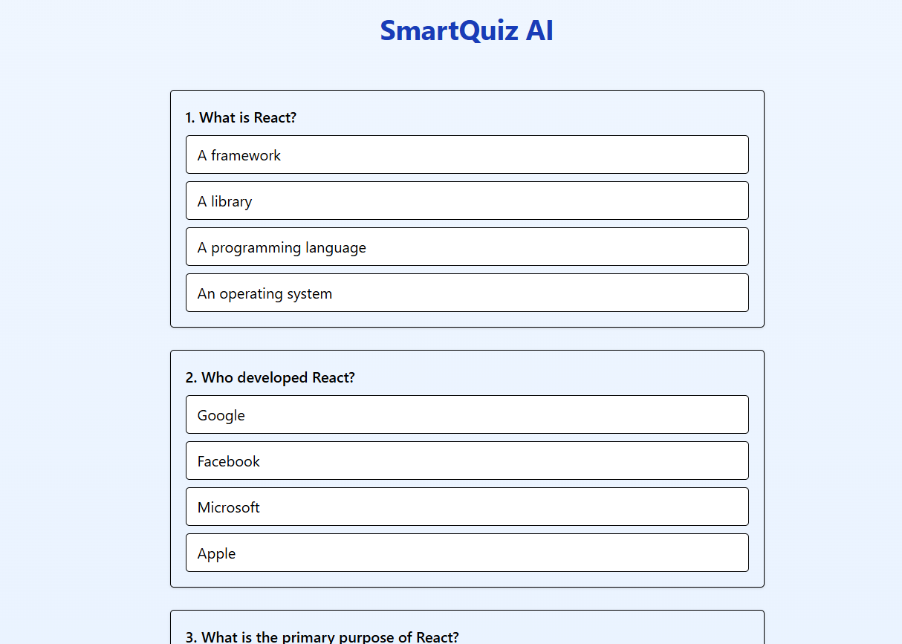

# SmartQuiz AI 🧠

SmartQuiz AI is a React-based quiz application that generates questions using AI, authenticates users via Google Sign-In, and stores scores securely in Firebase Firestore.

🔗 **Live Demo:** [smart-quiz-ai.vercel.app](https://smart-quiz-ai.vercel.app)

## ✨ Features

- 🔐 Google Sign-In with Firebase Authentication
- 🧠 AI-generated quiz questions (via OpenAI API)
- ✅ Shows correct & incorrect answers after submission
- 📊 Score tracking saved in Firebase Firestore under each authenticated user's profile
- 🎯 Clean and responsive UI with Tailwind CSS
- 🔁 Retake quiz option

---

## 🔧 Technologies Used

- **React + Vite** for the frontend
- **Tailwind CSS** for modern styling
- **Firebase Authentication** for login with Google
- **Firebase Firestore** to store user scores and responses
- **Node.js + Express** for backend API to integrate OpenAI
- **OpenAI API** to generate multiple-choice questions (MCQs)

---

## 🚀 Deployment

- Frontend hosted on **Vercel**  
- Backend can be hosted on **Render**, **Railway**, or similar platforms  
- Use environment variables for configuration:  

```env
VITE_BACKEND_URL=https://your-backend-url.com
OPENAI_API_KEY=your-openai-api-key

## 📸 Screenshots

### Login Page


### Quiz Page



### Prompt Page
